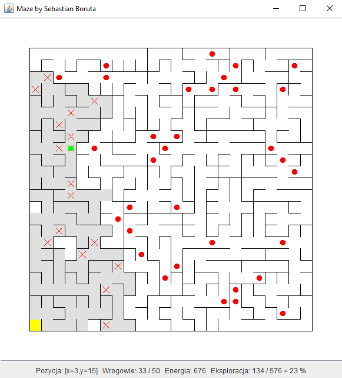
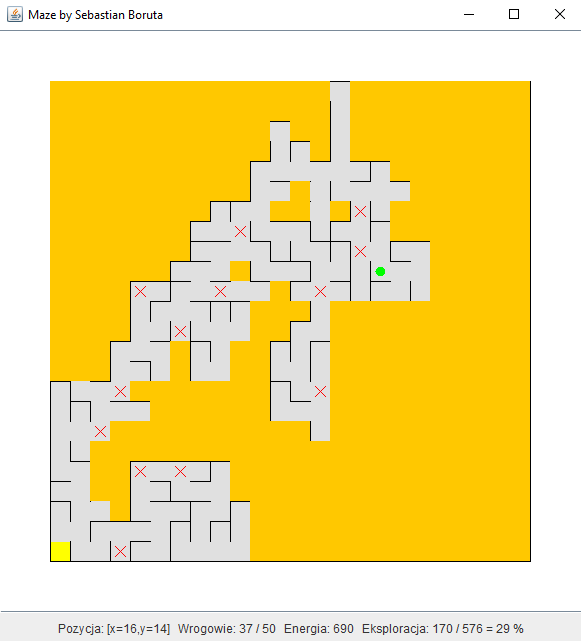

BackwardChaining
---

The application present backward chaining algorithm on the example of a limited energy agent, placed in a random maze, the purpose of which is to destroy enemies.

## About application

Application has been created as part of a student project in the subject "Intelligent computational techniques" at the Warsaw University of Technology by [Sebastian Boruta](https://boruta.info/).

The program is created in Java and uses Maven for dependency management and executions. Inference rules are created in Drools. The classes are described using Javadoc.

The application and comments are fully in English (screens came from a previous, working version translated to Polish).

The maze is created randomly using Aldous-Broder algorithm, the base is in position [0,0]. Enemies are randomly distributed. Each move takes the agent a certain amount of energy, in addition, each fight takes extra energy. The agent learns the labyrinth while moving as far as he can see in any direction from the position on which he found himself. When the amount of energy becomes low, the agent returns to the base and exits. The movements are displayed on the screen.

## Screenshots
Default view (god mode):



Agents perspective view:




**Legend:**
- _white fields_: unknown fields to agent
- _gray fields_: fields that the agent has known
- _yellow field_: agent base
- _orange field_: blurred field that the agent does not know (available in "agent view" mode)
- _green circle_: agent figure
- _red circle_: active enemy figure
- _red cross_: defeated enemy (corpse)

## Usage

The app uses Maven. To run it, execute command in cli:

```bash
mvn clean package exec:java
```

You can modify 3 most important parameters passing them as arguments:

```bash
mvn clean package exec:java "-Dexec.args=24 50 1000"
```

Args:
1. maze size (default 24 x 24)
2. number of enemies (default 50)
3. agent energy (default 1000)

You can change all settings in files marked as `Constant` in the folders of individual abstractions.
